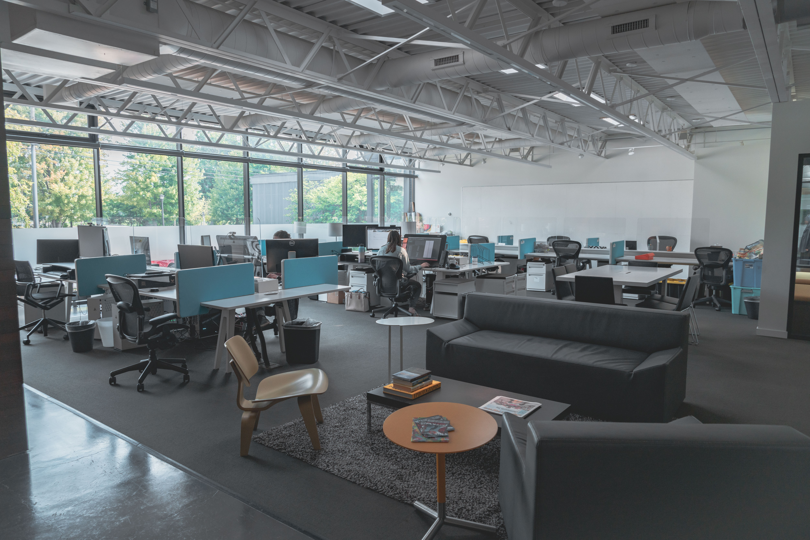

## Occupational:

I have gotten a really good job working at a big company that specializes in the user experience and design aspect of businesses who hire them. They are able to create personalized posters, menus, websites, social media advertisements, or anything else that they might need or request. This position has pretty good pay, is not too draining or demanding, and allows me to freely be my creative self, showing off my artistic skills to the company and clients. 

