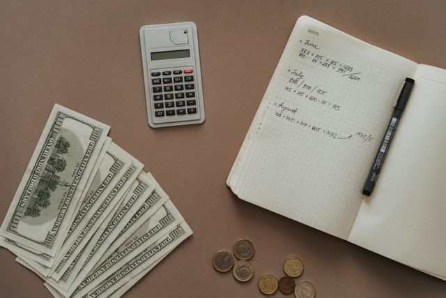

## Financial:

For these past 5 years since we last met, I have luckily been able to provide adequate support for myself and my family with the well paying job that I was able to get at the company. We have luckily been able to afford the necessities that my family needs, like food and water, bills, education, and healthcare, while still having plenty of savings left over for leisurely activities, personal wants, and emergency funds as well to live comfortably. 

